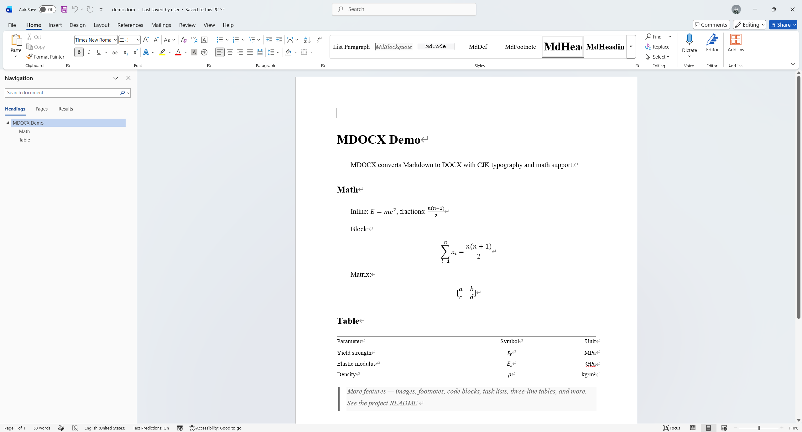

# MDOCX

[](README.zh.md)


[](LICENSE)


Markdown to DOCX converter and MCP server. Generates high-quality DOCX that requires no manual reformatting.



## Features

- **KaTeX math** — inline `$...$` and block `$$...$$`, ` ```math ` fenced blocks
- **Auto-embed images** — HTTP, local, SVG with PNG fallback
- **Footnotes** — `[^label]` syntax
- **Three-line tables** — academic paper style
- **Task lists** — checkboxes
- **Code blocks** — styled borders and background
- **CJK typography presets** — SimSun + Times New Roman, Heiti headings, first-line indent
- **MCP Server** — generate DOCX directly from AI tools (OpenCode, Claude Desktop, Cursor, etc.)

## Quick Start

```bash
npx @cylixlee/mdocx --input paper.md --output paper.docx
```

Presets: `--preset academic` (default) or `--preset minimal`

Config file: `--config style.json`, see `examples/sample-config.json`

## Installation

```bash
npm install -g @cylixlee/mdocx
# or
pnpm add -g @cylixlee/mdocx
```

## CLI Usage

```bash
mdocx --input paper.md
mdocx --input paper.md --output paper.docx
mdocx --input paper.md --preset minimal
mdocx --input paper.md --config style.json
mdocx --version
mdocx --help
```

| Option                | Description                                                |
| --------------------- | ---------------------------------------------------------- |
| `-i, --input <file>`  | Input .md file (required)                                  |
| `-o, --output <file>` | Output .docx file (defaults to .docx extension)            |
| `-p, --preset <name>` | Style preset: `academic` or `minimal` (default `academic`) |
| `-c, --config <file>` | JSON config file (may include preset, style, math, etc.)   |
| `-v, --version`       | Output version number                                      |

Presets: `academic` (default), `minimal`

Config file: see `examples/sample-config.json` for a full reference. `--preset` overrides the preset in a config file.

MCP mode: `mdocx mcp` starts an MCP server (stdio transport) for AI tools.

## MCP Server

Generate DOCX directly from AI tools.

### OpenCode

Edit `opencode.json`:

```json
{
  "mcp": {
    "mdocx": {
      "type": "local",
      "command": ["npx", "-y", "@cylixlee/mdocx", "mcp"],
      "enabled": true
    }
  }
}
```

### Claude Desktop

Edit `claude_desktop_config.json`:

```json
{
  "mcpServers": {
    "mdocx": {
      "command": "npx",
      "args": ["-y", "@cylixlee/mdocx", "mcp"]
    }
  }
}
```

### Tool: `convert_markdown_to_docx`

| Parameter    | Type                        | Required | Description                                     |
| ------------ | --------------------------- | -------- | ----------------------------------------------- |
| `inputPath`  | string                      | ✓        | Input .md file path                             |
| `outputPath` | string                      |          | Output .docx path (defaults to .docx extension) |
| `preset`     | `"academic"` \| `"minimal"` |          | Style preset                                    |
| `config`     | string                      |          | JSON config file path                           |

## Presets

**Academic** (default) — Times New Roman + SimSun, 12pt, 1.5× line spacing, Heiti headings, first-line indent, three-line tables.

**Minimal** — Calibri, 11pt, 1.15× line spacing, colored inline elements, Consolas code font.

Customization: `--config` with a JSON file deep-merges over the preset.

## Credits

Forked from [markdown-docx](https://github.com/vace/markdown-docx) · Built with [marked](https://marked.js.org), [KaTeX](https://katex.org), [docx](https://github.com/dolanmiu/docx) · CLI via [commander](https://github.com/tj/commander.js) · MCP via [@modelcontextprotocol/sdk](https://github.com/modelcontextprotocol/typescript-sdk)

This project is independently developed based on [markdown-docx](https://github.com/vace/markdown-docx) by [Vace](https://github.com/vace). I take full responsibility for the maintenance of this derivative work. Please do not report issues from this project to the original author; all issues should be submitted to this repository.
