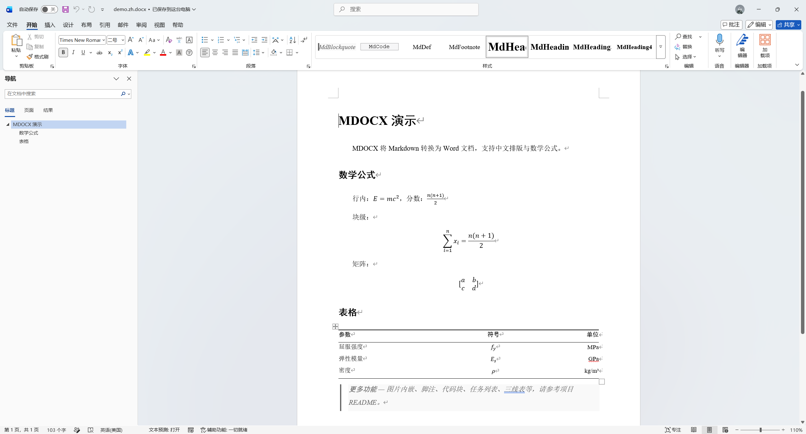

# MDOCX

[](README.md)


[](LICENSE)

将 Markdown 转换为 Word 文档的 MCP 服务。致力于生成无需手动二次排版的、高质量的 DOCX 文件。



## 特性

- **KaTeX 数学公式** — 行内 `$...$` 与块级 `$$...$$`，支持 ` ```math ` 围栏代码块
- **图片自动内嵌** — HTTP、本地文件、SVG（含 PNG 回退）
- **脚注** — `[^label]` 语法
- **三线表** — 学术论文风格
- **任务列表** — 复选框
- **代码块** — 带边框与背景样式
- **中文排版预设** — 宋体 + Times New Roman，标题黑体，首行缩进
- **MCP Server** — 在 OpenCode、Claude Desktop、Cursor 等 AI 工具内直接生成 DOCX

## 快速开始

```bash
npx @cylixlee/mdocx --input paper.md --output paper.docx
```

预设：`--preset academic`（默认）或 `--preset minimal`

配置文件：`--config style.json`，参考 `examples/sample-config.json`

## 安装

```bash
npm install -g @cylixlee/mdocx
# 或
pnpm add -g @cylixlee/mdocx
```

## CLI 用法

```bash
mdocx --input paper.md
mdocx --input paper.md --output paper.docx
mdocx --input paper.md --preset minimal
mdocx --input paper.md --config style.json
mdocx --version
mdocx --help
```

| 选项                  | 说明                                                 |
| --------------------- | ---------------------------------------------------- |
| `-i, --input <file>`  | 输入 Markdown 文件（必填）                           |
| `-o, --output <file>` | 输出 .docx 文件（默认替换扩展名为 .docx）            |
| `-p, --preset <name>` | 样式预设：`academic` 或 `minimal`（默认 `academic`） |
| `-c, --config <file>` | JSON 配置文件（可含 preset, style, math 等字段）     |
| `-v, --version`       | 输出版本号                                           |

预设：`academic`（默认），`minimal`

配置文件：参考 `examples/sample-config.json` 获取完整配置参考。`--preset` 会覆盖配置文件中的 preset 字段。

MCP 模式：`mdocx mcp` 启动 MCP server（stdio transport），供 AI 工具调用。

## MCP Server

在 AI 工具中直接生成 DOCX。

### OpenCode

编辑 `opencode.json`：

```json
{
  "mcp": {
    "mdocx": {
      "type": "local",
      "command": ["npx", "-y", "@cylixlee/mdocx", "mcp"],
      "enabled": true
    }
  }
}
```

### Claude Desktop

编辑 `claude_desktop_config.json`：

```json
{
  "mcpServers": {
    "mdocx": {
      "command": "npx",
      "args": ["-y", "@cylixlee/mdocx", "mcp"]
    }
  }
}
```

### 工具：`convert_markdown_to_docx`

| 参数         | 类型                        | 必填 | 说明                                      |
| ------------ | --------------------------- | ---- | ----------------------------------------- |
| `inputPath`  | string                      | ✓    | 输入 Markdown 文件路径                    |
| `outputPath` | string                      |      | 输出 .docx 路径（默认替换扩展名为 .docx） |
| `preset`     | `"academic"` \| `"minimal"` |      | 样式预设                                  |
| `config`     | string                      |      | JSON 配置文件路径                         |

## 预设样式

**Academic**（默认）— Times New Roman + 宋体，小四 12pt，1.5 倍行距，标题黑体，首行缩进，三线表。

**Minimal** — Calibri，11pt，1.15 倍行距，彩色行内元素，Consolas 代码字体。

自定义：`--config` 指定 JSON 文件，选项会深度合并到预设之上。

## 致谢

Forked from [markdown-docx](https://github.com/vace/markdown-docx) · Built with [marked](https://marked.js.org), [KaTeX](https://katex.org), [docx](https://github.com/dolanmiu/docx) · CLI via [commander](https://github.com/tj/commander.js) · MCP via [@modelcontextprotocol/sdk](https://github.com/modelcontextprotocol/typescript-sdk)

本项目基于 [markdown-docx](https://github.com/vace/markdown-docx)（作者 [Vace](https://github.com/vace)）进行独立开发。本人对本衍生项目的维护负全部责任。请勿向原作者报告本项目的任何问题，所有 issue 请提交至此仓库。
